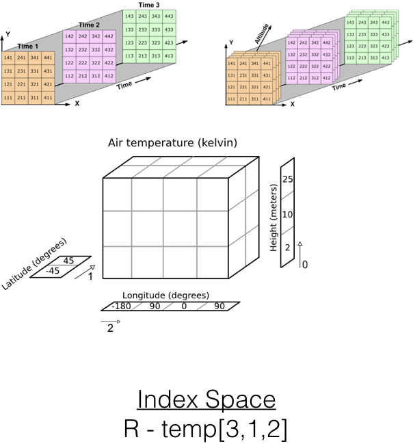

The following packages will be used in this demo:

- `httr`
- `ncdf4`
- `raster`
- `rerddap`
- `RNetCDF`
- `rerddapXtracto`
- `stars`
- `tidync`

The easy to install packages:

```{r installCRAN, eval = FALSE}
install.packages(httr, dependencies = TRUE)
install.packages(ncdf4, dependencies = TRUE)
install.packages(raster, dependencies = TRUE)
install.packages(rerddap, dependencies = TRUE)

```


The `RNetCDF` package can be installed from CRAN,  but for some operating systems it requires that the netCDF library, and all the other libraries it depends on, are installed separately.  If you don't need `RNetCDF`, or you don't have some combination of the tools, knowledge or permissions on your computer to do that type of installation, you might consider skipping installing `RNetCDF`.

```{r installRNetCDF, eval = FALSE}
install.packages(RNetCDF, dependencies = TRUE)

```

The `stars` package and the `tidync` package are only available from Github, note that if you install these they have a lot of dependencies,  so there may be a lot of packages added to you R library.

```{r installGit, eval = FALSE}
devtools::install_github("r-spatial/stars", dependencies = TRUE)
devtools::install_github("hypertidy/tidync", dependencies = TRUE)

```

The `rerddapXtracto` is only available from Github.  To use the package,  you have to install the Github version of `rerddap`.  The install may or may not try to install the package `plotdap`, which will then require installing a lot of other packages.  `rerddapXtracto` can run just fine without `plotdap`,   if this causes problems install wihtout dependencies.

```{r installXtracto, eval = FALSE}
devtools::install_github("ropensci/rerddap", dependencies = TRUE)
devtools::install_github("rmendels/rerddapXtracto", dependencies = TRUE)

```


Load all the packages that are needed:

```{r initialize}
library(httr)
library(ncdf4)
library(raster)
library(rerddap)
library(RNetCDF)
library(rerddapXtracto)
library(stars)
library(tidync)
```


# NetCDF Basics

Will only deal with reading netCDF files.  While the commands to create a netCDF file are not that difficult, to create a *good* netCDF file,  in particular one that follows `CF` and `ACDD` conventions, takes some work and knowledge.  Contact me separately if that is an interest or concern of yours.

## Data Cube


## Dimensions


## Array Space



In R terms,  just think of a multi-dimensional array,  with dimension names and attributes, but the dimensions themselves have values  (sometime put in as attributes or dimensions).


## Coordinate Space


## Not all netCDF file are created equal

* netCDF classic  (netCDF3)
* netCDF classic with  64-bit offset
* netCDF4 with classic format
* netCDF4  (allows things like chunking, compression, groups)

For just reading files,  if done correctly this should be hidden from users,  but may affect the choice of R package.


#  Accessing netCDF files

* "Open" file  (create a pointer to start of file)
* Get attribues (metadata) about the file and variables
* Create a pointer to a particular parameter
* Access a (subset of) that parameter
* "Close" the file
* Careful about c-order (row) versus R (and fortran-order) (column)
    + "ncdump" for example will give things in reverse order.

# Structure of a netCDF File

```{r ncdump, eval = FALSE}
system2('/sw/bin/ncdump', args = '-h poes.nc')
```


    netcdf poes {
    dimensions:
        time = 6 ;
        altitude = 1 ;
        latitude = 31 ;
        longitude = 51 ;
    variables:
        double time(time) ;
            time:_CoordinateAxisType = "Time" ;
            time:actual_range = 1410825600., 1423958400. ;
            time:axis = "T" ;
            time:fraction_digits = 0 ;
            time:ioos_category = "Time" ;
            time:long_name = "Centered Time" ;
            time:standard_name = "time" ;
            time:time_origin = "01-JAN-1970 00:00:00" ;
            time:units = "seconds since 1970-01-01T00:00:00Z" ;
        double altitude(altitude) ;
            altitude:_CoordinateAxisType = "Height" ;
            altitude:_CoordinateZisPositive = "up" ;
            altitude:actual_range = 0., 0. ;
            altitude:axis = "Z" ;
            altitude:fraction_digits = 0 ;
            altitude:ioos_category = "Location" ;
            altitude:long_name = "Altitude" ;
            altitude:positive = "up" ;
            altitude:standard_name = "altitude" ;
            altitude:units = "m" ;
        double latitude(latitude) ;
            latitude:_CoordinateAxisType = "Lat" ;
            latitude:actual_range = 36., 39. ;
            latitude:axis = "Y" ;
            latitude:coordsys = "geographic" ;
            latitude:fraction_digits = 1 ;
            latitude:ioos_category = "Location" ;
            latitude:long_name = "Latitude" ;
            latitude:point_spacing = "even" ;
            latitude:standard_name = "latitude" ;
            latitude:units = "degrees_north" ;
        double longitude(longitude) ;
            longitude:_CoordinateAxisType = "Lon" ;
            longitude:actual_range = 235., 240. ;
            longitude:axis = "X" ;
            longitude:coordsys = "geographic" ;
            longitude:fraction_digits = 1 ;
            longitude:ioos_category = "Location" ;
            longitude:long_name = "Longitude" ;
            longitude:point_spacing = "even" ;
            longitude:standard_name = "longitude" ;
            longitude:units = "degrees_east" ;
        float sst(time, altitude, latitude, longitude) ;
            sst:_FillValue = -9999999.f ;
            sst:colorBarMaximum = 32. ;
            sst:colorBarMinimum = 0. ;
            sst:coordsys = "geographic" ;
            sst:fraction_digits = 1 ;
            sst:ioos_category = "Temperature" ;
            sst:long_name = "Sea Surface Temperature" ;
            sst:missing_value = -9999999.f ;
            sst:standard_name = "sea_surface_temperature" ;
            sst:units = "degree_C" ;

    // global attributes:
            :acknowledgement = "NOAA NESDIS COASTWATCH, NOAA SWFSC ERD" ;
            :cdm_data_type = "Grid" ;
            :composite = "true" ;
            :contributor_name = "NOAA NESDIS OSDPD" ;
            :contributor_role = "Source of level 2 data." ;
            :Conventions = "COARDS, CF-1.6, Unidata Dataset Discovery v1.0" ;
            :creator_email = "dave.foley@noaa.gov" ;
            :creator_name = "NOAA CoastWatch, West Coast Node" ;
            :creator_url = "http://coastwatch.pfel.noaa.gov" ;
            :date_created = "2015-02-03Z" ;
            :date_issued = "2015-02-03Z" ;
            :Easternmost_Easting = 240. ;
            :geospatial_lat_max = 39. ;
            :geospatial_lat_min = 36. ;
            :geospatial_lat_resolution = 0.1 ;
            :geospatial_lat_units = "degrees_north" ;
            :geospatial_lon_max = 240. ;
            :geospatial_lon_min = 235. ;
            :geospatial_lon_resolution = 0.1 ;
            :geospatial_lon_units = "degrees_east" ;
            :geospatial_vertical_max = 0. ;
            :geospatial_vertical_min = 0. ;
            :geospatial_vertical_positive = "up" ;
            :geospatial_vertical_units = "m" ;
            :history = "NOAA NESDIS OSDPD\n",
                "2015-02-03T21:00:15Z NOAA CoastWatch (West Coast Node) and NOAA SFSC ERD\n",
                "2015-03-23T20:07:38Z http://oceanwatch.pfeg.noaa.gov/thredds/dodsC/satellite/AG/ssta/mday\n",
                "2015-03-23T20:07:38Z http://coastwatch.pfeg.noaa.gov/erddap/griddap/erdAGsstamday.nc?sst[last-5:1:last][(0.0):1:(0.0)][(36):1:(39)][(235):1:(240)]" ;
            :infoUrl = "http://coastwatch.pfeg.noaa.gov/infog/AG_ssta_las.html" ;
            :institution = "NOAA CoastWatch, West Coast Node" ;
            :keywords = "Oceans > Ocean Temperature > Sea Surface Temperature,\n",
                "avhrr, coastwatch, day, degrees, gac, global, monthly, night, noaa, ocean, oceans, poes, sea, sea_surface_temperature, sst, surface, temperature, wcn" ;
            :keywords_vocabulary = "GCMD Science Keywords" ;
            :license = "The data may be used and redistributed for free but is not intended\n",
                "for legal use, since it may contain inaccuracies. Neither the data\n",
                "Contributor, ERD, NOAA, nor the United States Government, nor any\n",
                "of their employees or contractors, makes any warranty, express or\n",
                "implied, including warranties of merchantability and fitness for a\n",
                "particular purpose, or assumes any legal liability for the accuracy,\n",
                "completeness, or usefulness, of this information." ;
            :Metadata_Conventions = "COARDS, CF-1.6, Unidata Dataset Discovery v1.0" ;
            :naming_authority = "gov.noaa.pfel.coastwatch" ;
            :Northernmost_Northing = 39. ;
            :origin = "NOAA NESDIS OSDPD" ;
            :processing_level = "3" ;
            :project = "CoastWatch (http://coastwatch.noaa.gov/)" ;
            :projection = "geographic" ;
            :projection_type = "mapped" ;
            :references = "NOAA POES satellites information: http://www.oso.noaa.gov/poes/index.htm . Processing link: http://www.osdpd.noaa.gov/PSB/PSB.html . Processing reference: Walton C. C., W. G. Pichel, J. F. Sapper, D. A. May. The development and operational application of nonlinear algorithms for the measurement of sea surface temperatures with the NOAA polar-orbiting environmental satellites. J.G.R., 103: (C12) 27999-28012, 1998. Cloudmask reference: Stowe, L. L., P. A. Davis, and E. P. McClain.  Scientific basis and initial evaluation of the CLAVR-1 global clear/cloud classification algorithm for the advanced very high resolution radiometer.  J. Atmos. Oceanic Technol., 16, 656-681. 1999. Calibration and Validation: Li, X., W. Pichel, E. Maturi, P. Clemente-Colon, and J. Sapper. Deriving the operational nonlinear multi-channel sea surface temperature algorithm coefficients for NOAA-15 AVHRR/3. International Journal of Remote Sensing, Volume 22, No. 4, 699 - 704, March 2001a. Calibration and Validation: Li, X, W. Pichel, P. Clemente-Colon, V. Krasnopolsky, and J. Sapper. Validation of coastal sea and lake surface temperature measurements derived from NOAA/AVHRR Data. International Journal of Remote Sensing, Vol. 22, No. 7, 1285-1303, 2001b." ;
            :satellite = "POES" ;
            :sensor = "AVHRR GAC" ;
            :source = "satellite observation: POES, AVHRR GAC" ;
            :sourceUrl = "http://oceanwatch.pfeg.noaa.gov/thredds/dodsC/satellite/AG/ssta/mday" ;
            :Southernmost_Northing = 36. ;
            :standard_name_vocabulary = "CF-12" ;
            :summary = "NOAA CoastWatch provides sea surface temperature (SST) products derived from NOAA\'s Polar Operational Environmental Satellites (POES).  This data provides global area coverage at 0.1 degrees resolution.  Measurements are gathered by the Advanced Very High Resolution Radiometer (AVHRR) instrument, a multiband radiance sensor carried aboard the NOAA POES satellites." ;
            :time_coverage_end = "2015-02-15T00:00:00Z" ;
            :time_coverage_start = "2014-09-16T00:00:00Z" ;
            :title = "SST, POES AVHRR, GAC, Global, Day and Night (Monthly Composite)" ;
            :Westernmost_Easting = 235. ;
    }


# C example

     netcdf sfc_pres_temp {
     dimensions:
     	latitude = 6 ;
     	longitude = 12 ;
     variables:
     	float latitude(latitude) ;
     		latitude:units = "degrees_north" ;
     	float longitude(longitude) ;
     		longitude:units = "degrees_east" ;
     	float pressure(latitude, longitude) ;
     		pressure:units = "hPa" ;
     	float temperature(latitude, longitude) ;
     		temperature:units = "celsius" ;
     data:
     
      latitude = 25, 30, 35, 40, 45, 50 ;
     
      longitude = -125, -120, -115, -110, -105, -100, -95, -90, -85, -80, -75, -70 ;
     
      pressure =
       900, 906, 912, 918, 924, 930, 936, 942, 948, 954, 960, 966,
       901, 907, 913, 919, 925, 931, 937, 943, 949, 955, 961, 967,
       902, 908, 914, 920, 926, 932, 938, 944, 950, 956, 962, 968,
       903, 909, 915, 921, 927, 933, 939, 945, 951, 957, 963, 969,
       904, 910, 916, 922, 928, 934, 940, 946, 952, 958, 964, 970,
       905, 911, 917, 923, 929, 935, 941, 947, 953, 959, 965, 971 ;
     
      temperature =
       9, 10.5, 12, 13.5, 15, 16.5, 18, 19.5, 21, 22.5, 24, 25.5,
       9.25, 10.75, 12.25, 13.75, 15.25, 16.75, 18.25, 19.75, 21.25, 22.75, 24.25,
         25.75,
       9.5, 11, 12.5, 14, 15.5, 17, 18.5, 20, 21.5, 23, 24.5, 26,
       9.75, 11.25, 12.75, 14.25, 15.75, 17.25, 18.75, 20.25, 21.75, 23.25, 24.75,
         26.25,
       10, 11.5, 13, 14.5, 16, 17.5, 19, 20.5, 22, 23.5, 25, 26.5,
       10.25, 11.75, 13.25, 14.75, 16.25, 17.75, 19.25, 20.75, 22.25, 23.75,
         25.25, 26.75 ;
     }

```{Rcpp cexample, eval = FALSE}
/* This is part of the netCDF package.
Copyright 2006 University Corporation for Atmospheric Research/Unidata.
See COPYRIGHT file for conditions of use.

This is an example which reads some surface pressure and
temperatures. The data file read by this program is produced by the
companion program sfc_pres_temp_wr.c. It is intended to illustrate
the use of the netCDF C API.

This program is part of the netCDF tutorial:
  http://www.unidata.ucar.edu/software/netcdf/docs/netcdf-tutorial

Full documentation of the netCDF C API can be found at:
  http://www.unidata.ucar.edu/software/netcdf/docs/netcdf-c

$Id: sfc_pres_temp_rd.c,v 1.5 2007/02/14 20:59:21 ed Exp $
  */
  
  #include <stdio.h>
  #include <string.h>
  #include <netcdf.h>
  
  /* This is the name of the data file we will read. */
  #define FILE_NAME "sfc_pres_temp.nc"
  
  /* We are reading 2D data, a 6 x 12 lat-lon grid. */
  #define NDIMS 2
  #define NLAT 6
  #define NLON 12
  
  #define LAT_NAME "latitude"
  #define LON_NAME "longitude"
  #define PRES_NAME "pressure"
  #define TEMP_NAME "temperature"
  
  /* These are used to calculate the values we expect to find. */
  #define SAMPLE_PRESSURE 900
  #define SAMPLE_TEMP 9.0
  #define START_LAT 25.0
  #define START_LON -125.0
  
  /* For the units attributes. */
  #define UNITS "units"
  #define PRES_UNITS "hPa"
  #define TEMP_UNITS "celsius"
  #define LAT_UNITS "degrees_north"
  #define LON_UNITS "degrees_east"
  #define MAX_ATT_LEN 80
  
  /* Handle errors by printing an error message and exiting with a
* non-zero status. */
  #define ERR(e) {printf("Error: %s\n", nc_strerror(e)); return 2;}
  
  int
main()
{
  int ncid, pres_varid, temp_varid;
  int lat_varid, lon_varid;
  
  /* We will read surface temperature and pressure fields. */
    float pres_in[NLAT][NLON];
  float temp_in[NLAT][NLON];
  
  /* For the lat lon coordinate variables. */
    float lats_in[NLAT], lons_in[NLON];
  
  
  /* We will learn about the data file and store results in these
  program variables. */
    int ndims_in, nvars_in, ngatts_in, unlimdimid_in;
  
  /* Loop indexes. */
    int lat, lon;
  
  /* Error handling. */
    int retval;
  
  /* Open the file. */
    if ((retval = nc_open(FILE_NAME, NC_NOWRITE, &ncid)))  
      ERR(retval);
  
  
    
    /* There are a number of inquiry functions in netCDF which can be
  used to learn about an unknown netCDF file. NC_INQ tells how
  many netCDF variables, dimensions, and global attributes are in
  the file; also the dimension id of the unlimited dimension, if
  there is one. */
    if ((retval = nc_inq(ncid, &ndims_in, &nvars_in, &ngatts_in,
                         &unlimdimid_in)))
      ERR(retval); 
    
    /* In this case we know that there are 2 netCDF dimensions, 4
  netCDF variables, no global attributes, and no unlimited
  dimension. */
    if (ndims_in != 2 || nvars_in != 4 || ngatts_in != 0 ||
        unlimdimid_in != -1) return 2;
  
  /* Get the varids of the latitude and longitude coordinate
  * variables. */
    if ((retval = nc_inq_varid(ncid, LAT_NAME, &lat_varid))) 
      ERR(retval); 
    if ((retval = nc_inq_varid(ncid, LON_NAME, &lon_varid)))
      ERR(retval); 
    
    /* Read the coordinate variable data. */
    if ((retval = nc_get_var_float(ncid, lat_varid, &lats_in[0])))
      ERR(retval); 
    if ((retval = nc_get_var_float(ncid, lon_varid, &lons_in[0])))
      ERR(retval); 
    
    
    /* Get the varids of the pressure and temperature netCDF
  * variables. */
    if ((retval = nc_inq_varid(ncid, PRES_NAME, &pres_varid)))
      ERR(retval);  
    if ((retval = nc_inq_varid(ncid, TEMP_NAME, &temp_varid)))
      ERR(retval); 
    
    /* Read the data. Since we know the contents of the file we know
  * that the data arrays in this program are the correct size to
  * hold all the data. */
    if ((retval = nc_get_var_float(ncid, pres_varid, &pres_in[0][0])))
      ERR(retval);  
    if ((retval = nc_get_var_float(ncid, temp_varid, &temp_in[0][0])))
      ERR(retval); 
    
    
    /* Each of the netCDF variables has a "units" attribute. Let's read
  them and check them. */
  if ((retval = nc_get_att_text(ncid, lat_varid, UNITS, lat_units_in)))
  ERR(retval); 
  
  /* Close the file. */
  if ((retval = nc_close(ncid)))
  ERR(retval);
  
  printf("*** SUCCESS reading example file sfc_pres_temp.nc!\n");
  return 0;

```

# R packages for netCDF

## RNetCDF

The `RNetCDF` package pretty much just provides an interface to the netCDF C-library, following the same paradigm as that library.  While for some uses and OSes you may find it easier to use than alternative packages,  I generally do not recommend it for several reasons:

- for some OSes requires separate installation of all the libraries required for netCDF (and there are a lot). With all the restrictions these days,  good luck with that.
- According to the documentation, the package does not support all netcdf file formats (it does support classic and 64-bit offset file formats, and NetCDF4-classic format); unfortunately the standard now at least for satellite data is full netCDF4.  YMMV.

Getting information about the file:


Opening a netCDF file:

```{r open_poes_rnetcdf}
my_file <- open.nc('poes.nc')
my_file
str(my_file)
```

The "odd" output is the value of the pointer to the file as returned by the C_library.

Getting information about the file:

```{r fileinq_poes_rnetcdf}
file.inq.nc(my_file)
```

Well this is very nice,  but we don't know for certain the dimensions,  the variable names and the order of the dimensions.  To get the equivalent of "ncdump" do:

```{r print_poes_rnetcdf}
print.nc(my_file)
```

If we wanted to write a general program that didn't require human intervention,  as in the C-interface we would have to:

* open the file
* get the number of dimnensions and variables
* loop over the dimensions to get dimension information
* loop over the number of variables to get variable information
* then extract desired variables

But I am too lazy to do that,  so I am just going to assume human intervention so I know the names and order of the dimensions and of the variables.

Extracting data:

```{r extract_poes_rnetcdf}
sst_rnetcdf <- var.get.nc(my_file, 'sst', c(1, 1, 1, 1), c(3, 3, 1, 2), collapse = FALSE, unpack = TRUE)
str(sst_rnetcdf)
```

** GOTCHAS **

* Will collapse dimensions of size 1,  unless collapse = FALSE  (collapse = TRUE is default)
* Some netcdf files have variables that have been "packed" - a scale and offset have been applied.  Will not unpack the data unless "unpack = TRUE", and by default "unpack = FALSE"

And good practice is to always close the file:

```{r close_poes_rnetcdf}
close.nc(my_file)
```


## ncdf4

The R package `ncdf4` attempts to make accessing netCDF files more "R-like".

### Opening a file

To "open" a netCDF file:

```{r open_poes_ncfd4}
my_file <- nc_open('poes.nc')
```

Let's see what the "print" method shows about the file:

```{r print_poes_infos_ncfd4}
my_file
```

It is essentially the header dump.  But actually there is more:

```{r str_poes_infos_ncfd4}
str(my_file)
```


As you can see it contains all sorts of information about the file, and put all this information in `R` structures, and the coordinate values have already been read in: 

```{r poes_lat_valuess_ncfd4}
my_file$dim$latitude$vals
```

If we don't know much about the file this is a convenience, as subsetting has to be done in index space, and it is not necessary to extract the coordinates.  But sometimes we don't want all that information,  because for high resolution data that can be a lot of data we don't need and takes up space,  or if there is an unlimited dimension,  usually time,  there can be a lot of time periods.  There are options that control this.  From the help:


`nc_open( filename, write=FALSE, readunlim=TRUE, verbose=FALSE, 
 	auto_GMT=TRUE, suppress_dimvals=FALSE )`

so we can suppress getting all the dimensions using `suppress_dimvals=TRUE` or suppress only getting the unlimited dimension with `readunlim=FALSE`.


### Extracting all of a parameter


```{r poes_sst_extract_gets_ncfd4}
sst <- ncvar_get(my_file, 'sst')
str(sst)
```

That's it. The call contains the "pointer" to the file, and the parameter name. And the data is in a nice R array.  The one thing you want to be aware of is by default `ncvar_get()` will collapse dimension of size 1.  There are times you want that dimension, if you do, the equivalent call would be:

```{r poes_sst_extract_get1s_ncfd4}
sst <- ncvar_get(my_file, 'sst', collapse_degen = FALSE)

```


Good practice is you should always "close" a file after extracting what you want:

```{r poes_sst_closes_ncfd4}
nc_close(my_file)
```

So the complete sequence to open a file, extracting one entire parameter,  and closing it is:

```{r poes_full_codes_ncfd4, eval = FALSE}
my_file <- nc_open('poes.nc')
sst <- ncvar_get(my_file, 'sst')
nc_close(my_file)
```


### Extracting a slice

But one of the nice features of netCDF files is that you can read in the header information separately, figure out what you want,  and extract only the portion of the data you desire, without having to read in and/or scan the entire dataset as their is direct access to the file.  For very large datafiles this is important.  So let's re-open the file and look at the dimensions:

```{r poes_show_dims}
my_file <- nc_open('poes.nc')
my_file$dim$latitude$vals
my_file$dim$longitude$vals
my_file$dim$time$vals
```

The time units,  as we saw before,  are in units "seconds since 1970-01-01T00:00:00Z", we can do a quick translation by:

```{r poes_convert_time}
iso_time <- as.POSIXct(my_file$dim$time$vals, origin = "1970-01-01", tz = "GMT")
iso_time
```

Suppose we want all the latitudes less than between 37 and 38, all the longitudes less than 236, and the first two time periods.  To do so,  we need to figure out the index of those values to pass to the function `ncvar_get()`.  For this example, we could count by hand, but for large datasets that would be impractical.

```{r poes_select_indices}
lat_min <- which(my_file$dim$latitude$vals == 37)
lat_max <- which(my_file$dim$latitude$vals == 38) - 1
lon_min <- 1
lon_max <- which(my_file$dim$longitude$vals == 236) - 1
```

Now we call `ncvar_get`,  but we tell it the index in each dimension of where to start, and how many values to extract:

```{r poes_sst_get_slice}
# remember altitude is a dimension of size 1
# order is longitude, latitude, altitude, time
# c-order versus fortran-order
start <- c(lon_min, lat_min, 1, 1)
count <- c(lon_max - lon_min + 1,  lat_max - lat_min + 1, 1, 3)
sst1 <- ncvar_get(my_file, 'sst', start = start, count = count)
str(sst1)
```

And voila,  what we desired. Now as good practice,  close the file:

```{r poes_close_slice}
nc_close(my_file)
```


## Accessing a remote file using `ncdf4` and OPeNDAP  (sorry no Windows need apply)

OPeNDAP is a protocol that allows for remote access to files. Any THREDDS server provides OPeNDAP access,  as does ERDDAP  (which also provides other services that are a little simpler and work in coordinate space).  The netCDF libraries support OPeNDAP,  and `ncdf4` does,  but not in Windows,  which is a long story but has to do with CRAN policies.  This support makes the access pretty transparent,  you open an URL instead of a file,  and the rest goes as usual.  Let's try accessing a POES dataset from ERDDAP using the same bounds,  and the first three time periods:

```{r poes_opendap_open}
my_url <- 'http://coastwatch.pfeg.noaa.gov/erddap/griddap/erdAGsstamday'
remote_file <- nc_open(my_url)
str(remote_file)
```


```{r poes_opendap_get_slice}
lat_min <- which(remote_file$dim$latitude$vals == 37)
lat_max <- which(remote_file$dim$latitude$vals == 38) - 1
lon_min <- which(remote_file$dim$longitude$vals == 235) 
lon_max <- which(remote_file$dim$longitude$vals == 236) - 1
start <- c(lon_min, lat_min, 1, 1)
count <- c(lon_max - lon_min + 1,  lat_max - lat_min + 1, 1, 3)
sst2 <- ncvar_get(remote_file, 'sst', start = start, count = count)
nc_close(remote_file)
str(sst2)
```

## raster

The only reason to use the `raster` package to read netCDF files is if you want a raster object.  The reason for this is `raster` just uses `ncdf4`.

-  Look at commands `raster()` and `brick()`
- Given the data imported using `ncdf`,  `raster()` can be used to convert to a raster.  Need to have the coordinate values.
- be careful of non-uniform coordinates

```{r poes_raster}
poes_raster <- raster('poes.nc')
poes_raster
print(poes_raster)
```


## tidync

[tidync](https://github.com/hypertidy/tidync) is a package that is under development.  It has three advantages:

- requests can be made coordinate space
- design to convert output to the "tidyverse"
- supports piping

Approach Using Traditional Steps:

1. Connect to file,  get information

```{r poes_tidync}
poes_file <- tidync('poes.nc')
poes_file
```

2.  Connect to one the parameters in the dataset

```{r poes_tidync_activate}
# only need to do this when multiple parameters,  not needed here.
poes_sst <- activate(poes_file, 'sst')
```

3.  Subset by coordinates

```{r poes_sst_tidync_filter}
# not that it mixes coordinate an index requests
poes_sst_filter <- hyper_filter(poes_sst, latitude = latitude == 37, time = index == 1)
```

4. Convert filter to tibble

```{r poes_sst_tidync_tibble}
poes_sst_tibble <- hyper_tibble(poes_sst_filter)
str(poes_sst_tibble)
unique(poes_sst_tibble$latitude)
unique(poes_sst_tibble$time)
```

Or using pipes,  we can do it all in one step:

```{r poes_sst_tidync_pipes}
poes_sst_tibble1 <- tidync('poes.nc') %>% hyper_filter(latitude = latitude == 37, time = index == 1) %>% hyper_tibble()
str(poes_sst_tibble1)
unique(poes_sst_tibble1$latitude)
unique(poes_sst_tibble1$time)

```

Some thoughts

- Depending on what you are doing, sometimes it is easier to work on multi-dimensional arrays, sometimes it is easier to work in the "tidyverse" 

- for some of the high-resolution datasets,  since data frames or tibbles repeat the coordinate variables, this can significantly increase the memory used. Some of our datasets are on a 750m grid,  extracts get quite large quite quickly.

## stars

[stars](https://github.com/r-spatial/stars) is package under development by the same person who wrote the `sf` package.  Sort of a grand extension to `raster`.  At moment `stars` uses `gdal` to read in netCDF. `gdal` in the past has been slow to keep with netCDF developments, has not been able to read all formats,  and has often made unwarrnated (and unneeded) assumptions about the file,  rather than reading the information that is in the file.  Worth following if you are into that sort of thing, but the interface has been changing over time,  and may change some more.

It is unclear to what extent you can do slicing,   but if you want to read in the entire file:

```{r starsSST}
stars_sst <- read_stars('poes.nc')
str(stars_sst)
```

Note that to be consistent over many formats,  the coordinate variables have been changed to "x, y".  I consider this for most of my uses a minus, not plus.

`stars` has one nice ability in that it can read in multiple files and aggregate over a dimension.  Here is an example from the "manual", but I don't have the files so it is not run but gives you the idea:

```{r starsAgg, eval = FALSE}
x = c(
"avhrr/avhrr-only-v2.19810901.nc",
"avhrr/avhrr-only-v2.19810902.nc",
"avhrr/avhrr-only-v2.19810903.nc",
"avhrr/avhrr-only-v2.19810904.nc",
"avhrr/avhrr-only-v2.19810905.nc",
"avhrr/avhrr-only-v2.19810906.nc",
"avhrr/avhrr-only-v2.19810907.nc",
"avhrr/avhrr-only-v2.19810908.nc",
"avhrr/avhrr-only-v2.19810909.nc"
)

(y = read_stars(x, quiet = TRUE))

# Next, we select sea surface temperature (sst), and drop the singular zlev (depth) dimension using adrop:
library(abind)
z <- y %>% select(sst) %>% adrop
```


# ERDDAP

## Direct download
Let's look at an ERDDAP URL and its components:

https://coastwatch.pfeg.noaa.gov/erddap/griddap/erdAGsstamday.nc?sst[(2003-08-16T12:00:00Z):1:(2003-10-16T12:00:00Z)][(0.0):1:(0.0)][(36):1:(37)][(236):1:(237)]

-Base URL - https://coastwatch.pfeg.noaa.gov/erddap
-Grid or Table - /griddap
-Dataset ID and file return type - /erdAGsstamday.nc
-start constraints - ?
-parameter name - sst
-time constraints (the parens mean coordinate space) - [(2003-08-16T12:00:00Z):1:(2003-10-16T12:00:00Z)]
-altitude constraints - [(0.0):1:(0.0)]
-latitude constraints - [(35):1:(36)]
-longitude constraints - [(236):1:(236)]

So anything in R that can send an URL and receive a file will work.  Since we are talking about netCDF,  will stay with gridded data,  though there are netCDF files with discrete geometry types. For small extracts if you don't need the array structure and data frames are okay,  you can read the data directly into R,  for example:

```{r poes_read.csv}
poes_csv_url <- 'http://coastwatch.pfeg.noaa.gov/erddap/griddap/erdAGsstamday.csvp?sst[(2003-08-16T12:00:00Z):1:(2003-10-16T12:00:00Z)][(0.0):1:(0.0)][(36):1:(37)][(236):1:(237)]'
poes_sst <- read.csv(poes_csv_url, stringsAsFactors = FALSE)
str(poes_sst)
```


For large extracts (and in a lot of these hi-res datasets the extracts get very large), .cvs files get way too large, best to download a netCDF file.  We have already seen how to read in a netCDF file, so it is now just a question of downloading the request.  One way is to use `download.file()`
```{r poes_download.file}
poes_url = 'http://coastwatch.pfeg.noaa.gov/erddap/griddap/erdAGsstamday.nc?sst[(2003-08-16T12:00:00Z):1:(2003-10-16T12:00:00Z)][(0.0):1:(0.0)][(36):1:(37)][(236):1:(237)]'
download.file(poes_url, 'poes_sst.nc' , mode = 'wb')
```

For a little more control of the download, and the error message sent (if any), try using `httr::GET()`:

```{r poes_httr, eval = FALSE}
myHTTP <- httr::GET(poes_url, httr::verbose(), httr::progress(), httr::write_disk('poes_sst.nc', overwrite = TRUE))
```

## rerddap - More R like access to ERDDAP

Using `rerddap` is pretty straightfoward:

1.  Get the information about the dataset

```{r poes_rerddap_info}
# you have to first find the datasetid on the desired ERDDAP
# the default ERDDAP is https://upwell.pfeg.noaa.gov/erddap
# have to give the base URL if not, ending with a slash
poes_info <- info('erdAGsstamday', url = 'https://coastwatch.pfeg.noaa.gov/erddap/')
poes_info
str(poes_info)
```

2. Request the subset of the variable - by default it is read into R as a tibble, the raw netcdf file is saved in the cache space

```{r poes_rerddap_subset}
poes_rerddap_subset <- griddap(poes_info, fields = 'sst', latitude = c(37, 37), time = c('2003-08-16T12:00:00Z', '2003-08-16T12:00:00Z'))
str(poes_rerddap_subset)
```

Let's look at the cache:

```{r poes_rerddap_cache}
cache_info()
cache_list()
```

So if we wanted to we could move and rename that file to be used later.
Alternatively,  if we would prefer just getting the output as a netCDF file that we will read in ourselves, and put where it is easier to find - important also because in some cases the cache will disappear when the session ends:

```{r poes_rerddap_noread}
poes_rerddap_subset1 <- griddap(poes_info, fields = 'sst', latitude = c(37, 37), time = c('2003-08-16T12:00:00Z', '2003-08-16T12:00:00Z'), read = FALSE, store = disk(path = '/Users/rmendels/Documents/Years/FY18/Presentations/NetCDF_presentation'))
file_path <- attr(poes_rerddap_subset1, "path")
file.rename(file_path, 'download.nc')
```

### rerddap gotcha - cacheing and "last"

ERDDAP allows a time to be defined as "last", and even allows arithmetic on "last",  so the last 5 days would be `c(last - 4,  last)`.  If you do use last, be certain about your `rerddap` cache.  If a previous request to last had been made,  and the last time in the dataset has changed,  you will get the cache return, not the new return.

## rerddapXtracto

[rerddapXtracto](https://github.com/rmendels/rerddapXtracto)  is a package that extends the `rerddap` package to allow extracting data along a track and inside a polygon.  At present it is only on Github. I will show two quick examples  (1 track,  1 polygon) and plot using a package called `plotdap`.  Some caveats - `rerddapXtracto` requires the Github version of `rerddap` and `plotdap` requires a bunch of other software to be installed.  More details on how to use the package and various options for plotting see these [vignettes](https://rmendels.github.io)

Track example:

```{r marlin_track_extract}
tagData <- Marlintag38606
xpos <- tagData$lon
ypos <- tagData$lat
tpos <- tagData$date
zpos <- rep(0., length(xpos))
urlbase <- 'http://upwell.pfeg.noaa.gov/erddap'
swchlInfo <- rerddap::info('erdSWchla8day')
swchl <- rxtracto(swchlInfo, parameter = 'chlorophyll', xcoord = xpos, ycoord = ypos, tcoord = tpos, zcoord = zpos, xlen = .2, ylen = .2)
str(swchl)
```


Now plot the data using `plotdap`

```{r marlin_track_plot}
myPlot <- plotTrack(swchl, xpos, ypos, plotColor = 'chlorophyll')
myPlot
```

Polygon example - MBNMS

```{r mbnms_extract}
dataInfo <- rerddap::info('etopo180')
xpos <- mbnms$Longitude
ypos <- mbnms$Latitude
bathy <- rxtractogon(dataInfo, parameter = 'altitude', xcoord = xpos, ycoord = ypos)
str(bathy)
```

Plotting the result:

```{r mbnms_plot}
myFunc = function(x) -x
bathyPlot <- plotBBox(bathy, plotColor = 'density', myFunc = myFunc, name = 'Depth')
bathyPlot
```

